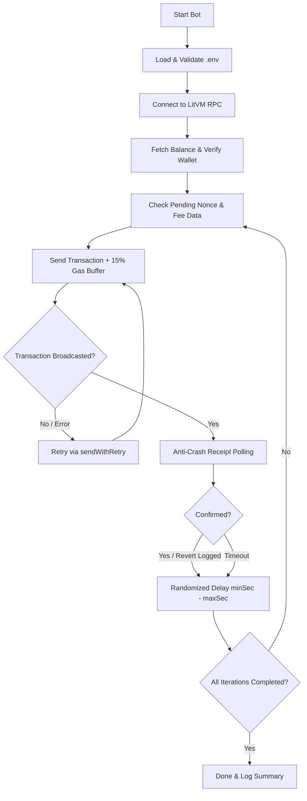

# 🚀 AuraLaunch Presale & Interaction Bot (LitVM LiteForge Testnet)

[](LICENSE)
[](https://nodejs.org/)
[](https://docs.ethers.org/v6/)
[](https://liteforge.rpc.caldera.xyz/http)

An automated, resilient Web3 bot designed to interact with the **AuraLaunch** presale pool and smart contracts on the **LitVM LiteForge Testnet** (AuraFlow). Built with **Ethers.js v6**, featuring RPC retry wrappers, dynamic gas bumping, anti-crash receipt polling, and randomized execution intervals.

---

## 📋 Table of Contents

- [Features](#-features)
- [LitVM LiteForge Network Info](#-litvm-liteforge-network-info)
- [Architecture & Flow](#-architecture--flow)
- [Prerequisites](#-prerequisites)
- [Installation & Quick Start](#-installation--quick-start)
- [Configuration (.env)](#-configuration-env)
- [Available Commands](#-available-commands)
- [Security & Safety Guidelines](#-security--safety-guidelines)
- [Disclaimer](#-disclaimer)
- [License](#-license)

---

## ✨ Features

- **🛡️ Resilient RPC Failure Recovery**: Automatically handles Caldera RPC hiccups, `502 Bad Gateway`, and timeouts with exponential/linear retry mechanisms.
- **⚡ Anti-Crash Polling**: Custom receipt confirmation polling (`waitForReceipt`) that prevents Node.js process crashes even during peak block latency or RPC drops.
- **⛽ Dynamic Gas Optimization**: Automatically fetches current gas prices and applies a **+15% buffer** to ensure quick block inclusion without stalling pending nonces.
- **🎲 Randomized Delay Intervals**: Simulates realistic transaction pacing with randomized delays between executions to maintain network health.
- **🔍 Contract Bytecode Verifier**: Includes a dedicated script (`check-contract.js`) to verify that the target address contains valid deployed bytecode before broadcasting transactions.
- **⚙️ 100% Configurable**: All operational parameters (gas limit, calldata, amount, delay range, iterations) are managed cleanly via environment variables.

---

## 🌐 LitVM LiteForge Network Info

| Parameter | Value |
| :--- | :--- |
| **Network Name** | LitVM LiteForge Testnet |
| **Chain ID** | `4441` |
| **Currency Symbol** | `zkLTC` |
| **RPC URL** | `https://liteforge.rpc.caldera.xyz/http` |
| **Explorer** | `https://liteforge.explorer.caldera.xyz` |

---

## 🔄 Architecture & Flow



---

## 📦 Prerequisites

Before running the bot, ensure you have:
- [Node.js](https://nodejs.org/) version **18.x or higher** installed.
- A testnet wallet with some **zkLTC** balance on LitVM LiteForge.
- Target contract address on AuraLaunch.

---

## 🚀 Installation & Quick Start

### 1. Clone the repository
```bash
git clone https://github.com/gomedz/aura_bot.git
cd aura_bot
```

### 2. Install dependencies
```bash
npm install
```

### 3. Configure Environment Variables
Copy the sample environment file and adjust your settings:
```bash
cp .env.example .env
```
*(On Windows Command Prompt: `copy .env.example .env`, or in PowerShell: `Copy-Item .env.example .env`)*

Open `.env` in your text editor and fill in your burner wallet's private key:
```ini
PRIVATE_KEY=your_burner_wallet_private_key_here
```

### 4. Verify Target Contract
Run the built-in checker to confirm the smart contract exists and is active on the network:
```bash
npm run check
```

### 5. Run the Bot
Start the transaction cycle:
```bash
npm start
```

---

## ⚙️ Configuration (.env)

All configurations are defined in your local `.env` file (never commit this file!):

| Variable | Default Value | Description |
| :--- | :--- | :--- |
| `RPC_URL` | `https://liteforge.rpc.caldera.xyz/http` | LitVM LiteForge RPC endpoint |
| `CHAIN_ID` | `4441` | Network Chain ID |
| `PRIVATE_KEY` | *(Required)* | Private key of the executing testnet wallet |
| `LAUNCHPAD_CONTRACT` | `0xC623189CbA3ec0b5B46A0eBf593064a83b05F6d4` | Target presale / pool contract address |
| `CALLDATA` | `0xa6f2ae3a` | Function selector / calldata for transaction |
| `GAS_LIMIT` | `180000` | Gas limit assigned per transaction |
| `AMOUNT_PER_TX` | `0.0001` | Amount of zkLTC sent per transaction |
| `TOTAL_TRANSACTIONS` | `10` | Total number of transactions to execute |
| `MIN_DELAY_SEC` | `5` | Minimum random delay between transactions (seconds) |
| `MAX_DELAY_SEC` | `15` | Maximum random delay between transactions (seconds) |

---

## 🛠️ Available Commands

| Command | Action |
| :--- | :--- |
| `npm start` | Runs the main transaction bot (`bot.js`) |
| `npm run check` | Checks target contract existence and bytecode size (`check-contract.js`) |

---

## 🔒 Security & Safety Guidelines

> [!CAUTION]
> **CRITICAL SECURITY NOTICE:**
> - **NEVER** use your mainnet, ledger, or cold storage private key with this bot.
> - **ALWAYS** use a dedicated burner testnet wallet with only minimal testnet funds.
> - The `.gitignore` file is preconfigured to ignore `.env` files. **Never force-add or commit `.env` to GitHub**.
> - Regularly audit your repository before pushing to ensure no API keys, private keys, or secrets are tracked.

---

## ⚠️ Disclaimer

This project is created strictly for **educational, testing, and research purposes** on the LitVM LiteForge Testnet. Use at your own risk. The author assumes no liability for any losses, failed transactions, network fees, or unwanted on-chain outcomes caused by the use or misuse of this script.

---

## 📄 License

This project is licensed under the [MIT License](LICENSE).
